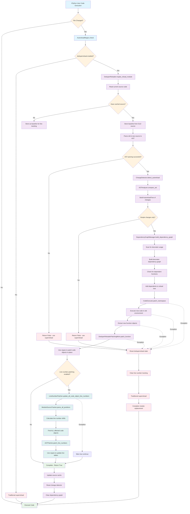
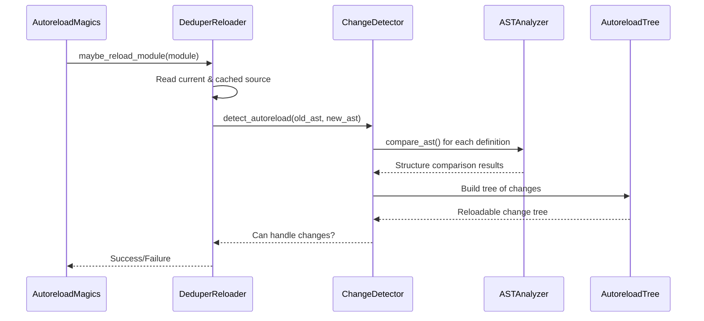
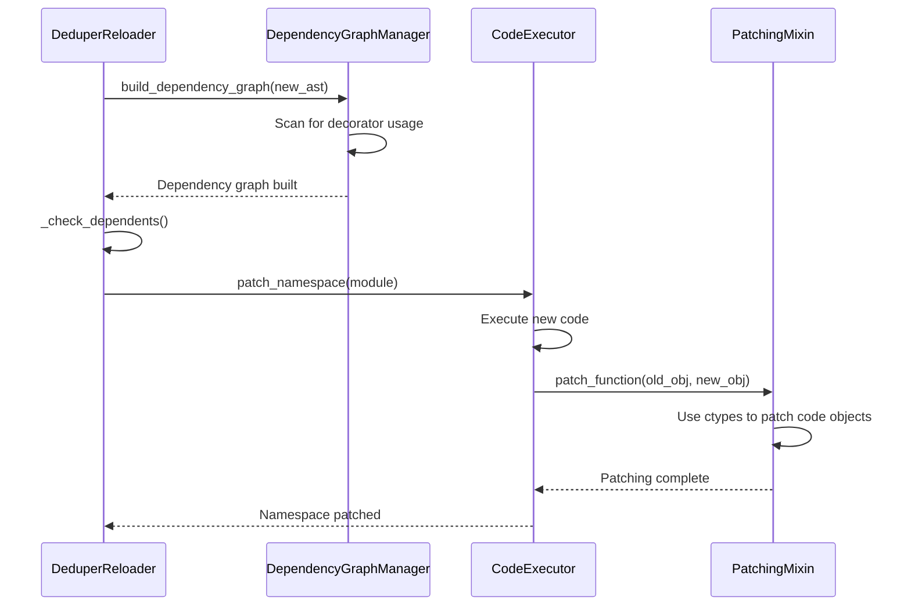
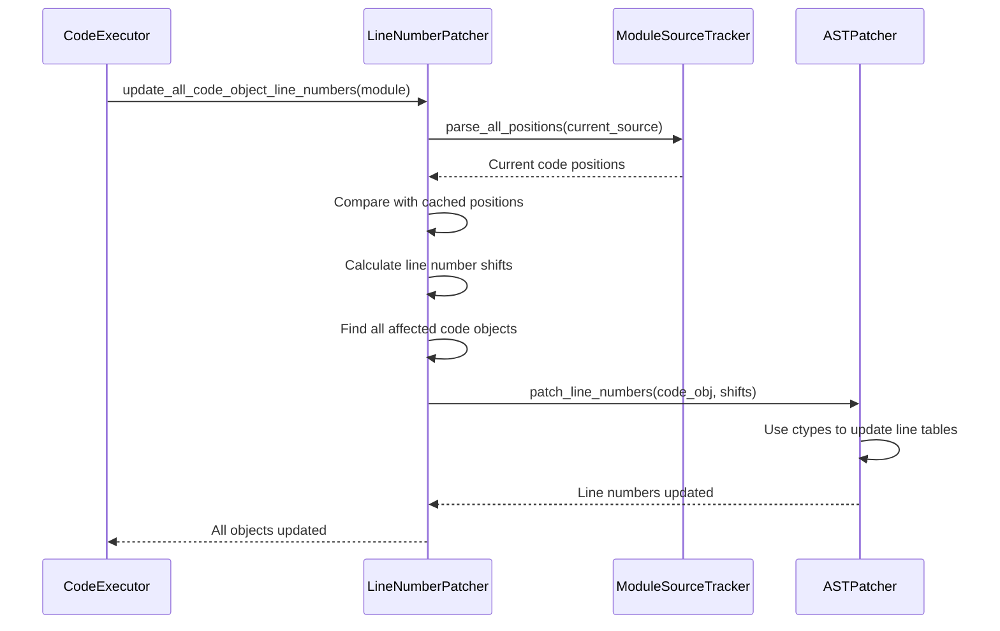

# DeduperReload Extension for IPython

## Overview

The DeduperReload extension provides intelligent, selective code reloading for IPython that preserves object identity and state whenever possible. Instead of reloading entire modules like traditional autoreload, deduperreload performs AST-based analysis to identify exactly what has changed and patches only those specific functions, methods, or classes in-place.

## Key Features

- **Selective Reloading**: Only patches changed functions/classes, preserving object identity
- **AST-Based Analysis**: Compares code structure, not just timestamps
- **Line Number Accuracy**: Maintains correct traceback line numbers after reloading
- **Decorator Dependency Tracking**: Automatically reloads functions that use modified decorators
- **Fallback Safety**: Falls back to traditional autoreload for complex changes
- **CPython Optimization**: Uses ctypes for efficient in-place patching

## Architecture Components

### Core Components

1. **DeduperReloader** - Main orchestrator that coordinates the entire reloading process
2. **ChangeDetector** - AST comparison engine that identifies what has changed
3. **CodeExecutor** - Handles code execution and in-place patching of objects
4. **LineNumberPatcher** - Maintains traceback accuracy by updating line numbers
5. **DependencyGraphManager** - Tracks decorator dependencies for proper reload ordering

### Supporting Components

6. **ASTPatcher** - AST manipulation for line number correction (Python 3.11+)
7. **LineNumberTracker** - Tracks source code positions and calculates line shifts
8. **DeduperReloaderPatchingMixin** - Low-level ctypes-based object patching utilities

## Integration with IPython Autoreload

The deduperreload system integrates seamlessly with IPython's existing autoreload extension:

- **Enabled by default** when using `%autoreload 2` (or other modes)
- **Disabled** when using `%autoreload 2-` or `--full` flag
- **Automatic fallback** to traditional autoreload if deduperreload cannot handle changes
- **Transparent operation** - users experience faster, more reliable reloading

## Control Flow Diagram



## Detailed Component Interactions

### 1. Change Detection Pipeline



### 2. Dependency Tracking & Patching



### 3. Line Number Patching Pipeline



## Usage Examples

### Basic Usage
```python
# In IPython
%load_ext autoreload
%autoreload 2  # deduperreload enabled by default

# Edit your Python files - only changed functions are reloaded
# Object identity and state are preserved
```

### Disable DeduperReload
```python
%autoreload 2-     # Disable deduperreload, use traditional autoreload
%autoreload 2 --full  # Same as above
```

### Enable/Disable Line Number Patching
```python
# Access the deduperreload instance
reloader = get_ipython().magic_mgr.registry.get_plugin("AutoreloadMagics")._reloader.deduper_reloader
reloader.enable_line_number_patching = False  # Disable for performance
```

## When DeduperReload is Used vs Fallback

### DeduperReload Handles:
- Function body changes
- Method modifications
- Simple class changes
- Decorator applications (with dependency tracking)
- Constant assignments
- Import additions/modifications

### Falls Back to Traditional Autoreload:
- Complex structural changes (inheritance modifications)
- Class signature changes
- Module-level control flow changes
- Non-constant expressions
- AST parsing failures

## Performance Benefits

1. **Faster Reloading**: Only changed functions are processed
2. **State Preservation**: Object identity maintained, avoiding reference invalidation
3. **Memory Efficiency**: No complete module recreation
4. **Debugger Friendly**: Breakpoints and watchers remain valid
5. **Hot Reloading**: Changes apply immediately without losing context

## Compatibility

- **Python Version**: 3.8+ (optimal on 3.11+ with enhanced AST support)
- **Platform**: CPython only (uses ctypes for low-level patching)
- **IPython**: Integrated with standard autoreload extension
- **Jupyter**: Full compatibility with Jupyter notebooks

## Troubleshooting

### Common Issues

1. **Complex Changes Not Reloading**: Check if deduperreload fell back to traditional autoreload
2. **Line Number Mismatches**: Enable line number patching if disabled
3. **Decorator Dependencies**: Ensure decorator functions are properly tracked
4. **Memory Leaks**: Rarely, ctypes patching may create reference cycles

### Debug Mode
```python
# Enable verbose logging to see what deduperreload is doing
import logging
logging.getLogger('autoreload').setLevel(logging.INFO)
```

## Technical Implementation Notes

### ctypes-based Patching
DeduperReload uses ctypes to directly modify Python object structures in memory, enabling true in-place updates that preserve object identity. This is much faster than recreating objects but requires careful memory management.

### AST Analysis
The system parses Python source code into Abstract Syntax Trees and performs structural comparisons to identify changes. This approach is more reliable than timestamp-based checking and enables intelligent change classification.

### Line Number Correction
When functions change size, all subsequent line numbers in the module shift. The line number patcher tracks these changes and updates ALL affected code objects to maintain traceback accuracy.

### Decorator Dependency Tracking
The system builds a dependency graph of decorator usage, ensuring that when a decorator function changes, all functions using that decorator are also reloaded automatically.

## Future Enhancements

- **PyPy Support**: Investigate compatibility with alternative Python implementations
- **Enhanced AST Analysis**: Support for more complex code patterns
- **Performance Optimizations**: Further reduce latency for large codebases
- **IDE Integration**: Better integration with development environments
- **Distributed Systems**: Support for reloading in distributed Python applications